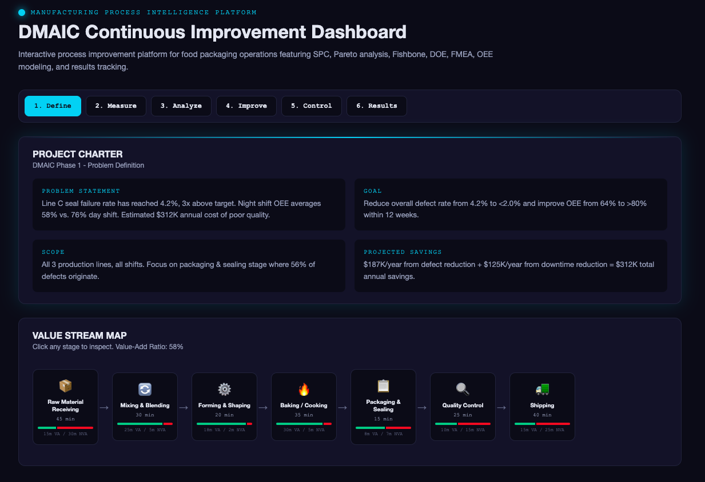
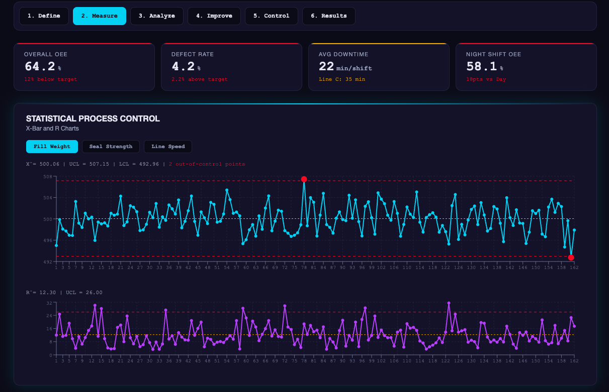
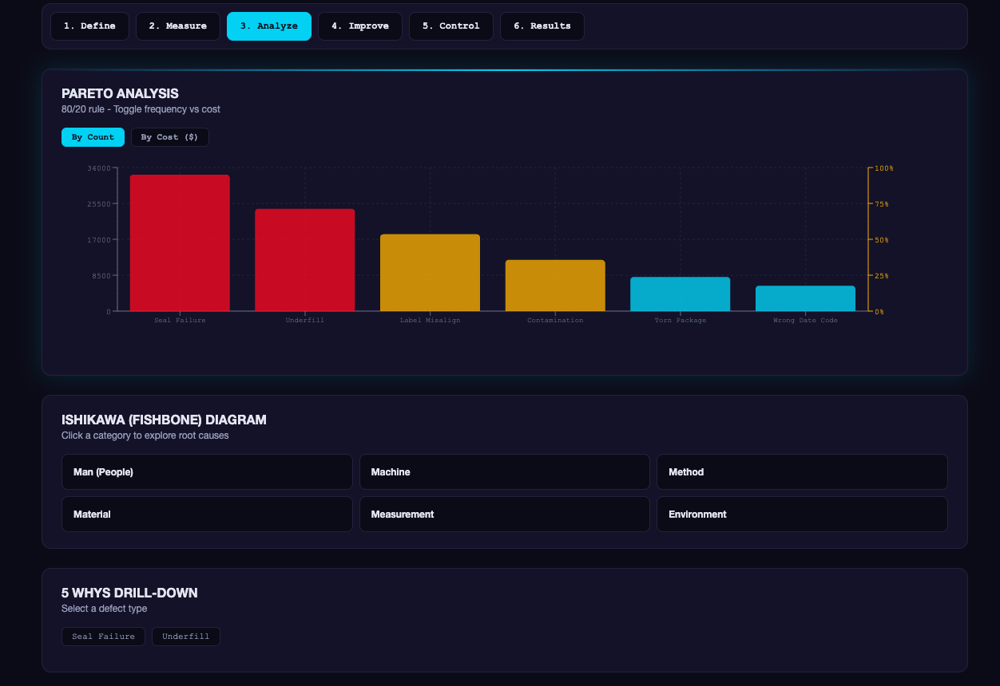
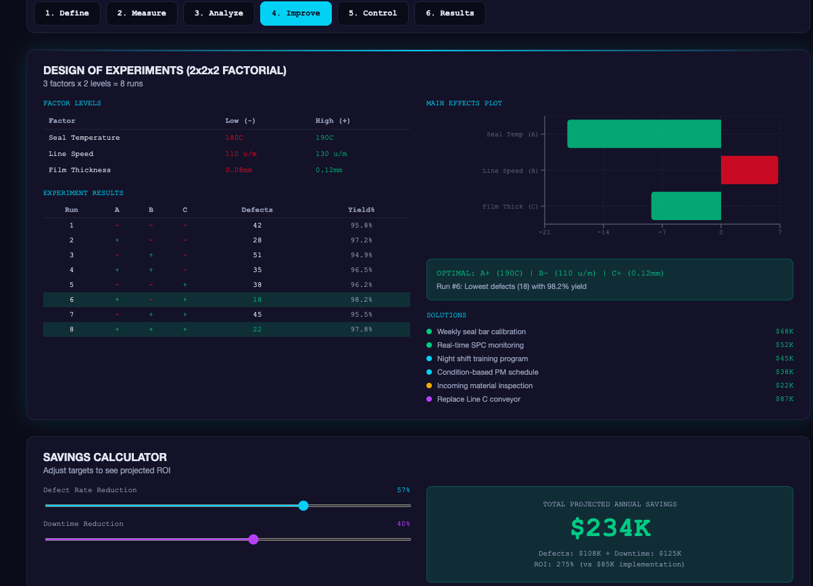
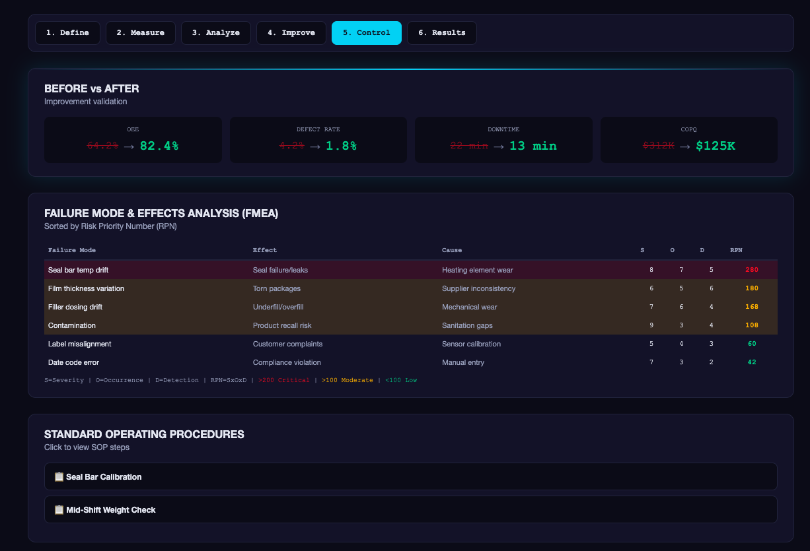
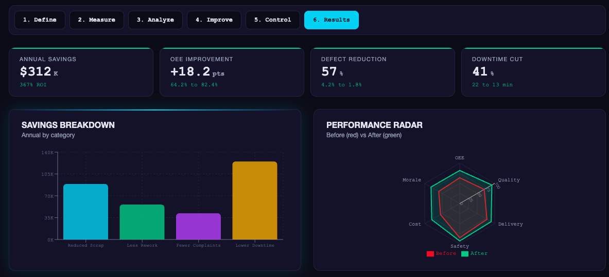

# Manufacturing Process Intelligence Platform

**Interactive DMAIC continuous improvement platform for food packaging operations**

**[Click Here for Live Demo]([https://REPLACE_STACKBLITZ_URL](https://react-dtrmxrkl.stackblitz.io/))** | Power BI Dashboard (see screenshots below)
[https://REPLACE_STACKBLITZ_URL](https://react-dtrmxrkl.stackblitz.io/)
---

## Executive Summary

A food packaging plant is experiencing rising defect rates (4.2% vs 2.0% target) and declining OEE (64% vs 85% world class). Night shift performance lags day shift by 18 percentage points. Annual cost of poor quality: **$312K**.

This project applies the **DMAIC methodology** (Lean Six Sigma) to identify root causes, design experiments, implement solutions, and establish control plans — projecting **$312K annual savings** through 57% defect reduction and 18-point OEE improvement.

---

## Key Results

| Metric | Before | After | Improvement |
|--------|--------|-------|-------------|
| OEE | 64.2% | 82.4% | +18.2 pts |
| Defect Rate | 4.2% | 1.8% | -57% |
| Downtime | 22 min/shift | 13 min/shift | -41% |
| COPQ | $312K/year | $125K/year | -$187K |

---

## Technical Skills Demonstrated

| Skill | Where It Appears |
|-------|-----------------|
| Statistical Process Control (SPC) | Tab 2 — X-bar and R control charts with UCL/LCL |
| Process Capability (Cp/Cpk) | Tab 2 — Distribution analysis with spec limits |
| OEE Calculation | Tab 2 — Interactive calculator (Availability x Performance x Quality) |
| Pareto Analysis | Tab 3 — 80/20 defect prioritization by count and cost |
| Ishikawa (Fishbone) Diagram | Tab 3 — 6M root cause categories |
| 5 Whys Analysis | Tab 3 — Interactive drill-down to root cause |
| Correlation Analysis | Tab 3 — Variable relationship heatmap |
| Design of Experiments (DOE) | Tab 4 — 2x2x2 factorial design with main effects plot |
| FMEA (Risk Analysis) | Tab 5 — Failure modes with RPN scoring |
| Control Plans | Tab 5 — Parameter monitoring with reaction plans |
| Standard Operating Procedures | Tab 5 — Interactive SOP viewer |
| Value Stream Mapping | Tab 1 — VA/NVA time analysis across 7 process stages |
| DMAIC Framework | Entire project structure |
| Data Visualization (Power BI) | Companion dashboard with KPI tracking |
| Python (Pandas, NumPy, Matplotlib) | Data generation and statistical analysis |
| React / JavaScript | Interactive web platform with 6 tabs |

---

## DMAIC Methodology

### Phase 1: Define
- Project Charter with problem statement, goal, scope, and projected savings
- Value Stream Map showing 7 process stages with value-add vs non-value-add time
- Identified packaging and sealing stage as source of 56% of defects

### Phase 2: Measure
- SPC Control Charts (X-bar and R) for fill weight, seal strength, and line speed
- Process Capability Analysis with Cp and Cpk calculations
- OEE Baseline: 64.2% overall, Night shift at 58.1%
- KPI Dashboard tracking defect rate, downtime, and COPQ

### Phase 3: Analyze
- Pareto Analysis: top 2 defects (Seal Failure + Underfill) = 56% of all defects
- Ishikawa Diagram with 24 potential causes across 6 categories
- 5 Whys traced seal failures to lack of condition-based preventive maintenance
- Correlation Analysis between temperature, humidity, and defect rates

### Phase 4: Improve
- 2x2x2 Factorial DOE testing seal temperature, line speed, and film thickness
- Optimal settings: 190C seal temp, 110 u/min speed, 0.12mm film
- Impact vs Effort Matrix prioritizing 6 solutions
- Savings Calculator projecting $312K annual savings

### Phase 5: Control
- FMEA Table with RPN scoring (seal bar temp drift = highest risk at RPN 280)
- Control Plan for 5 critical parameters
- SOPs for seal bar calibration and mid-shift weight checks
- Before/After Validation: OEE 64.2% to 82.4%

---
## Screenshots
### Interactive DMAIC Platform












### Power BI Dashboard


---
## 🛠️ Tech Stack

- **Frontend:** React, Recharts, D3.js
- **Data Analysis:** Python, Pandas, NumPy, Matplotlib, Seaborn
- **Business Intelligence:** Microsoft Power BI
- **Statistical Methods:** SPC, DOE, FMEA, Process Capability
- **Methodologies:** DMAIC, Lean Six Sigma, Value Stream Mapping
- **Hosting:** StackBlitz
- **Version Control:** Git, GitHub

---

## 📁 Repository Structure

```
manufacturing-process-intelligence/
├── src/
│   └── App.js                     # Interactive DMAIC platform (React)
├── data/
│   └── production_data.csv        # Simulated production dataset
├── docs/
│   ├── screenshots/               # Dashboard screenshots
│   └── powerbi_dashboard.pdf      # Power BI export
├── public/
│   └── index.html                 # Entry point
├── package.json
└── README.md
```

---

## How to Run Locally

```
git clone https://github.com/REPLACE_GITHUB_USERNAME/manufacturing-process-intelligence.git
cd manufacturing-process-intelligence
npm install
npm start
```

Then open http://localhost:3000

---

## About

Built by **Simran** as a process improvement portfolio project demonstrating end-to-end DMAIC methodology with technical implementation.

**Bachelor of Science| University of Waterloo | 2026
